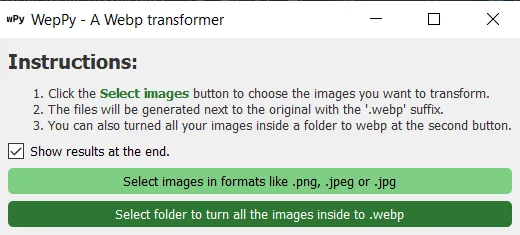

# WepPy

Weppy is a tool for generating webp images. WebP also pronounced «weppy» is a format that reduces dramatically the size of images without losing significant details, most modern browser support it and using may improve your performance on your website. This tools provides a simple UI for turning your images offline.

## Table of Contents

- [Installation](#installation)
- [Usage](#usage)
- [Compatibility](#compatibility)
- [License](#license)

## Installation

In order to use this you have to install the libraries by typing:
```bash
pip install -r requirements.txt
```
## Usage
In order to execute the interface use:
```bash
python wep.py
```
, and the next window will open:



There you can select images or a folder to turn images to webp format.
## Compatibility
The app is compatible with **.jpg**, **.jpeg** and **.png**.
## License
This project is licensed under the MIT License - see the LICENSE file for details
